<h1>Hi There, I'm Tarun </h1>

> **Renaissance-class offensive security researcher with demonstrated global top-tier depth in multiple rare niches and shipped production engineering capability.**

## About Me

I work across **cybersecurity**, **AI/ML**, **software protection**, and **low-level engineering** — with a focus on problems that demand both depth and breadth. My core work spans reverse engineering and binary analysis across Windows, macOS, Linux, Android, and iOS; software protection research on commercial protectors and virtualization systems; mobile application security including native library analysis and runtime instrumentation; and API protocol analysis with authentication internals and anti-bot research.

Beyond security, I build AI-powered products, real-time data pipelines, developer tools, and scalable backend systems. My work spans from native code and assembly-level analysis to full-stack product development — I'm comfortable anywhere on the stack, and most drawn to hard engineering problems where the interesting answers live below the surface.

I'm open to serious collaboration around **security consulting**, **software protection engineering**, **AI/ML tooling**, **data infrastructure**, and **developer automation**.

  
  
  
  

## Skill Set :muscle:

These are the areas and tools I work with most often:

**Languages**

<table>
  <tr>
    <td align="center"> Rust</td>
    <td align="center"> Go</td>
    <td align="center"> Python</td>
    <td align="center"> JavaScript</td>
    <td align="center"> TypeScript</td>
    <td align="center"> C#</td>
    <td align="center"> Swift</td>
    <td align="center"> Objective-C</td>
  </tr>
  <tr>
    <td align="center"> Dart</td>
    <td align="center"> C</td>
    <td align="center"> C++</td>
    <td align="center"> Kotlin</td>
    <td align="center"> Java</td>
    <td align="center"> SQL</td>
    <td align="center"> HTML</td>
    <td align="center"> CSS</td>
  </tr>
</table>

**Core Domains**

  
  
  
  

**Low-Level Specialization**

  
  
  
  

**Platforms & Security Areas**

  
  
  
  

**Applied Engineering**

  
  
  
  

**Product & Interface Work**

  
  
  
  

**Frontend**

<table>
  <tr>
    <td align="center"> React</td>
    <td align="center"> Next.js</td>
    <td align="center"> Tailwind</td>
    <td align="center"> Vite</td>
    <td align="center"> Webpack</td>
    <td align="center"> Dart</td>
    <td align="center"> React Native</td>
    <td align="center"> Flutter</td>
  </tr>
</table>

**Backend**

<table>
  <tr>
    <td align="center"> Node.js</td>
    <td align="center"> Express</td>
    <td align="center"> NestJS</td>
    <td align="center"> FastAPI</td>
    <td align="center"> Flask</td>
    <td align="center"> Django</td>
    <td align="center"> .NET</td>
    <td align="center"> GraphQL</td>
  </tr>
</table>

**Databases**

<table>
  <tr>
    <td align="center"> PostgreSQL</td>
    <td align="center"> MongoDB</td>
    <td align="center"> SQLite</td>
    <td align="center"> MySQL</td>
    <td align="center"> Redis</td>
    <td align="center"> Cassandra</td>
    <td align="center"> Elasticsearch</td>
    <td align="center"> Firebase</td>
  </tr>
</table>

**Tools**

<table>
  <tr>
    <td align="center"> Git</td>
    <td align="center"> Linux</td>
    <td align="center"> Docker</td>
    <td align="center"> Postman</td>
    <td align="center"> VS Code</td>
    <td align="center"> Jupyter</td>
    <td align="center"> GitHub</td>
    <td align="center"> npm</td>
  </tr>
</table>

**Software**

  
  
  
  
  
  
  
  

**Cloud & Infra**

  
  
  
  
  
  

## GitHub Stats :chart_with_upwards_trend:

  <picture>
    <source media="(prefers-color-scheme: dark)" srcset="./profile/stats-dark.svg" />
    <source media="(prefers-color-scheme: light)" srcset="./profile/stats-light.svg" />
    
  </picture>
  <picture>
    <source media="(prefers-color-scheme: dark)" srcset="https://streak-stats.demolab.com/?user=tanu360&theme=github-dark-blue&hide_border=true&background=00000000&stroke=30363D&ring=58A6FF&fire=58A6FF&currStreakLabel=58A6FF&sideLabels=C9D1D9&dates=8B949E" />
    <source media="(prefers-color-scheme: light)" srcset="https://github-readme-streak-stats.herokuapp.com/?user=tanu360&theme=default&hide_border=true&background=00000000&stroke=D0D7DE&ring=0969DA&fire=0969DA&currStreakLabel=0969DA&sideLabels=1F2328&dates=656D76" />
    
  </picture>

  <picture>
    <source media="(prefers-color-scheme: dark)" srcset="./profile/top-langs-dark.svg" />
    <source media="(prefers-color-scheme: light)" srcset="./profile/top-langs-light.svg" />
    
  </picture>
  <picture>
    <source media="(prefers-color-scheme: dark)" srcset="./profile/wakapi-dark.svg" />
    <source media="(prefers-color-scheme: light)" srcset="./profile/wakapi-light.svg" />
    
  </picture>

## Stargazers :earth_asia:

  

## Contribution Activity :zap:

  <a href="https://github.com/tanu360">
    <picture>
      <source media="(prefers-color-scheme: dark)" srcset="https://github-readme-activity-graph.vercel.app/graph?username=tanu360&bg_color=0d1117&color=c9d1d9&title_color=58a6ff&line=10a37f&point=f59e0b&area=true&area_color=0e7490&hide_border=true&custom_title=Contribution%20Activity" />
      <source media="(prefers-color-scheme: light)" srcset="https://github-readme-activity-graph.vercel.app/graph?username=tanu360&bg_color=f8fafc&color=1f2937&title_color=1f6feb&line=0e7490&point=f59e0b&area=true&area_color=10a37f&hide_border=true&custom_title=Contribution%20Activity" />
      
    </picture>
  </a>

**Selected Work**

- [ida-chat-plugin](https://github.com/tanu360/ida-chat-plugin) — AI-assisted chat interface for IDA Pro, distributed through the official Hex-Rays `hcli` plugin registry.
- [nanobananademo](https://github.com/tanu360/nanobananademo) — generation, editing, and upscaling pipeline built on modern AI image models.
- [claude-code-dashboard](https://github.com/tanu360/claude-code-dashboard) — code-agent UX and analytics dashboard.

**Notable Open Source Repositories**

- [Facebook-SSL-Pinning-Bypass](https://github.com/tanu360/Facebook-SSL-Pinning-Bypass) — native library analysis and SSL pinning bypass research on production Android.
- [Instagram-SSL-Pinning-Bypass](https://github.com/tanu360/Instagram-SSL-Pinning-Bypass) — mobile traffic interception research on the Meta ecosystem.
- [apple-intelligence-api](https://github.com/tanu360/apple-intelligence-api) — OpenAI-compatible server on top of Apple's on-device Foundation Models.
- [chatjimmy-reverse-api](https://github.com/tanu360/chatjimmy-reverse-api) — dual OpenAI + Anthropic compatibility layer with streaming and tool calling.
- [facebook-checker-v4](https://github.com/tanu360/facebook-checker-v4) — automation tooling research.

## Let's Connect :handshake:

